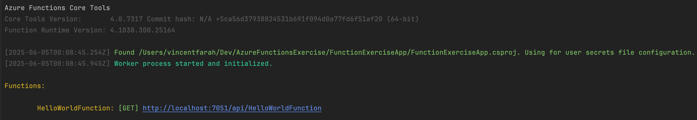
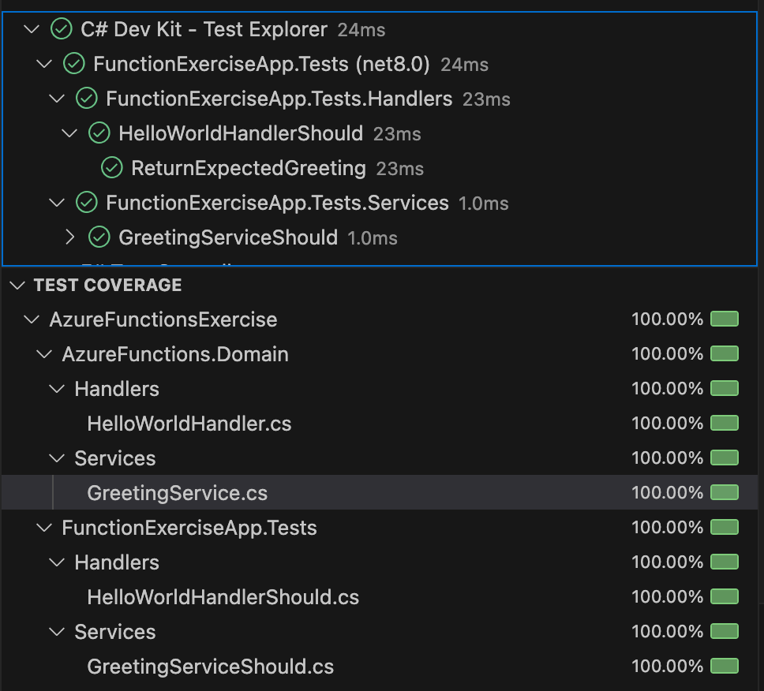

# Azure Functions Exercise
Practise Serverless and get your ducks in a row. So I use rider and vscode on a mac to set my biased context but I will share links for all IDE and OS types.

### ✅ Prerequisites

- [.NET 8 SDK](https://dotnet.microsoft.com/download)
- [Azure Functions Core Tools v4+](https://learn.microsoft.com/en-us/azure/azure-functions/functions-run-local)
- [Visual Studio 2022+](https://visualstudio.microsoft.com/) with Azure Functions tools OR VS Code with Azure Functions extension
- An Azure subscription (for deployment)

The following steps use Homebrew to install the Core Tools on macOS.

1. Install [Homebrew](https://brew.sh/), if it's not already installed.

2. Install the Core Tools package:

   Bash

   ```bash
   brew tap azure/functions
   brew install azure-functions-core-tools@4
   # if upgrading on a machine that has 2.x or 3.x installed:
   brew link --overwrite azure-functions-core-tools@4
   ```

To implement **Azure Functions** using **C#**, you can either:

1. Use **in-process** Azure Functions (runs within the Azure Functions host).
2. Use the **isolated worker process model** (runs separately with .NET 6+ / .NET 8).

### 🔧 Recommended: .NET 8 Isolated Worker Model (Modern Approach)

#### 📁 Step 1: Create a new Azure Functions Project

```bash
❯ func init FunctionExerciseApp --worker-runtime dotnetIsolated --target-framework net8.0
❯ cd FunctionExerciseApp
❯ func new --name HelloWorldFunction --template "HttpTrigger"
```

This generates:

- A `.csproj` using .NET 8 and isolated worker SDK
- A `Program.cs` that configures the host
- A function like `HelloWorldFunction.cs`

------

#### 📄 Step 2: Example Azure Function (C#)

**HelloWorldFunction.cs**

```csharp
using System.Net;
using AzureFunctions.Domain.Handlers;
using Microsoft.Azure.Functions.Worker;
using Microsoft.Extensions.Logging;
using Microsoft.Azure.Functions.Worker.Http;

namespace FunctionExerciseApp;

[ExcludeFromCodeCoverage(Justification = "Thin glue, Azure-only concerns tested by Microsoft")]
public class HelloWorldFunction(ILogger<HelloWorldFunction> logger, IHelloWorldHandler handler)
{
    [Function("HelloWorldFunction")]
    public async Task<HttpResponseData> Run([HttpTrigger(AuthorizationLevel.Anonymous, "get")] HttpRequestData req)
    {
        logger.LogInformation("C# HTTP trigger function processed a request.");
        var message = await handler.HandleAsync("Vincent");
        var response = req.CreateResponse(HttpStatusCode.OK);
        await response.WriteStringAsync(message);
        return response;
    }
}

```

------

#### 🏁 Step 3: Run Locally

```bash
func start
```

Visit: http://localhost:7071/api/HelloWorld

------

#### ☁️ Step 4: Deploy to Azure

##### Option A: From CLI

```bash
az login
az functionapp create --resource-group <your-rg> --consumption-plan-location westeurope --runtime dotnet-isolated --functions-version 4 --name <your-func-name> --storage-account <your-storage>
func azure functionapp publish <your-func-name>
```

##### Option B: From Visual Studio

- Right-click the project → *Publish*
- Choose *Azure Function App (Windows/Linux)* → Select or create a target → Publish

------

### ✅ Observations for Your Architecture Style

Given your emphasis on **clean code, SOLID, and DDD**:

- You can split logic into services and inject them via `DI` in the constructor.
- Define input/output bindings declaratively (e.g., BlobTrigger, QueueTrigger, CosmosDBTrigger).
- Keep functions as orchestration points, delegating real logic to injected services.

------

#### DI Setup (Program.cs)

```csharp
var builder = FunctionsApplication.CreateBuilder(args);

builder.ConfigureFunctionsWebApplication();

builder.Services
    .AddApplicationInsightsTelemetryWorkerService()
    .ConfigureFunctionsApplicationInsights();
builder.Services
    .AddSingleton<IGreetingService, GreetingService>()
    .AddSingleton<IHelloWorldHandler, HelloWorldHandler>();
builder.Build().Run();
```




### XUnit Testing

#### 🔧 1. Function Class (Thin Wrapper)

This keeps your function declaration minimal and moves logic out.

```csharp
using AzureFunctions.Domain.Services;
using Microsoft.Azure.Functions.Worker;
using Microsoft.Azure.Functions.Worker.Http;
using System.Net;
using System.Threading.Tasks;

public class HelloWorldFunction
{
    private readonly IHelloWorldHandler _handler;

    public HelloWorldFunction(IHelloWorldHandler handler)
    {
        _handler = handler;
    }

    [Function("HelloWorld")]
    public async Task<HttpResponseData> Run(
        [HttpTrigger(AuthorizationLevel.Function, "get")] HttpRequestData req)
    {
        var message = await _handler.HandleAsync();

        var response = req.CreateResponse(HttpStatusCode.OK);
        response.Headers.Add("Content-Type", "text/plain; charset=utf-8");
        await response.WriteStringAsync(message);
        return response;
```

#### ✅ 2. Service Class with Logic (Testable)

```csharp
namespace AzureFunctions.Domain.Handlers;

public interface IHelloWorldHandler
{
    Task<string> HandleAsync(string name);
}

public class HelloWorldHandler(IGreetingService greetingService) : IHelloWorldHandler
{
    public Task<string> HandleAsync(string name = "Vincent")
    {
        return Task.FromResult(greetingService.GetGreeting(name));
```

#### 🧪 3. xUnit Test (No need to mock HTTP abstractions)

```csharp
public class HelloWorldHandlerShould
{
    [Fact]
    public async Task ReturnExpectedGreeting()
    {
      	// Arrange
        var mockGreetingService = new Mock<IGreetingService>();
        mockGreetingService
            .Setup(greetingService => greetingService.GetGreeting("Vincent"))
            .Returns("Hello Vincent!");
        var handler = new HelloWorldHandler(mockGreetingService.Object);
      	// Act
        var actual = await handler.HandleAsync("Vincent");
      	// Assert
        Assert.Equal("Hello Vincent!", actual);
```

#### ✅ Summary

| Component                | Role                           | Testable? |
| ------------------------ | ------------------------------ | --------- |
| `HelloWorldFunction`     | Thin glue, Azure-only concerns | ❌ Skip    |
| `HelloWorldHandler`      | Real business logic            | ✅ Yes     |
| `HelloWorldHandlerTests` | Pure logic tests, no fakes     | ✅ Yes     |



## References

- [Getting Started with Azure Functions: C# and Visual Studio Code Tutorial](https://www.youtube.com/watch?v=Mb_eUDwVHos)

- [Getting Started With Azure Functions - HTTP & Timer Triggers](https://www.youtube.com/watch?v=l3beXs3o-0w)
