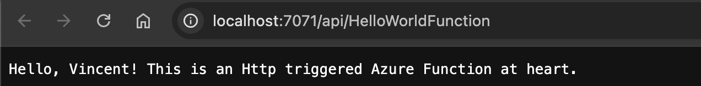

[TOC]

# Azure Functions Exercise

Practise Serverless and get your ducks in a row. I use rider and vscode on a mac, to set up my context but no worries, I will share links for all IDE and OS types.

*When is serverless better than Kubernetes?* The answer depends on *what* you're building - **serverless** and **Kubernetes** solve different problems and offer distinct trade-offs. However, in many contexts, **serverless** can be *better* than Kubernetes when your goals are **speed of delivery**, **low operational overhead**, and **cost efficiency at scale**. Here's a breakdown:

## ⚖️ Serverless vs Kubernetes

| Feature / Characteristic         | **Serverless (e.g. Azure Functions)**    | **Kubernetes (e.g. AKS, EKS, GKE)**                      |
| -------------------------------- | ---------------------------------------- | -------------------------------------------------------- |
| **Operational Overhead**         | Near zero - no infrastructure to manage  | High - manage clusters, nodes, networking, scaling       |
| **Scalability**                  | Auto-scales per event or request         | Manual or auto-scaling, but requires config & monitoring |
| **Billing**                      | Pay-per-use (GB-s & invocations)         | Pay-per-resource (CPU, RAM, pods) - even if idle         |
| **Cold Starts**                  | Possible, especially in dynamic triggers | No cold starts - pods stay up (if configured)            |
| **Deployment Complexity**        | Simple (single artifact, few concepts)   | High (YAML, Helm, controllers, operators)                |
| **Abstractions**                 | High-level (just write code)             | Low-level (manage containers, services, ingress)         |
| **Custom Workloads / Long Jobs** | Poor fit - max execution time limits     | Ideal for bespoke runtimes, jobs, queues, stateful apps  |
| **Vendor Lock-in**               | High (e.g. Azure Functions, AWS Lambda)  | Lower (K8s is portable across clouds/on-prem)            |
| **Local Dev & Debug**            | Improving (e.g. Azurite + func CLI)      | Requires Docker + K8s tooling                            |

### ✅ When Serverless is Better

1. **Short-lived workloads**
    e.g. APIs, webhooks, event handlers, automation scripts.
2. **Variable or Spiky Load**
    Scale from 0 to thousands instantly without pre-provisioning.
3. **Low Ops Team Size**
    Serverless offloads provisioning, scaling, patching, and availability.
4. **Cost Control at Low Volume**
    You only pay when the code runs, ideal for prototypes, event-driven logic, or infrequent processes.
5. **Tightly Integrated with Platform**
    e.g. Azure Functions + Event Grid + CosmosDB triggers = powerful glue code.

### ❌ Where Kubernetes Might Be Better

- **You need full control over the runtime**, storage, network policies, and service mesh.
- **Stateful, long-running or custom workloads** like data processing pipelines, gameservers, or ML model hosting.
- **Multi-tenant SaaS with container isolation requirements**.
- **You’re running polyglot microservices** not easily expressible as functions.

### 🔍 Realistic Trade-Off in Enterprise

| Scenario                                 | Better Choice      | Why                                          |
| ---------------------------------------- | ------------------ | -------------------------------------------- |
| Data ingestion pipeline                  | Serverless         | Simple scale-out and event triggers          |
| Background processing / queue workers    | Serverless (short) | Consumption-based, triggers from storage/bus |
| API Gateway with bursty traffic          | Serverless         | Auto-scales, pay-per-request                 |
| Complex backend with inter-service comms | Kubernetes         | Fine-grained control, service mesh, retries  |
| Hosting a UI app + backend               | K8s or hybrid      | UIs often need static hosting + API          |

## ✅ Prerequisites

- [.NET 8 SDK](https://dotnet.microsoft.com/download)
- [Azure Functions Core Tools v4+](https://learn.microsoft.com/en-us/azure/azure-functions/functions-run-local)
- [Visual Studio 2022+](https://visualstudio.microsoft.com/) with Azure Functions tools OR VS Code with Azure Functions extension
- An Azure subscription (for deployment)

The following steps use Homebrew to install the Core Tools on macOS.

1. Install [Homebrew](https://brew.sh/), if it's not already installed.

2. Install the Core Tools package:

   Bash

   ```bash
   brew tap azure/functions
   brew install azure-functions-core-tools@4
   # if upgrading on a machine that has 2.x or 3.x installed:
   brew link --overwrite azure-functions-core-tools@4
   ```

To implement **Azure Functions** using **C#**, you can either:

1. Use **in-process** Azure Functions (runs within the Azure Functions host).
2. Use the **isolated worker process model** (runs separately with .NET 6+ / .NET 8).

### 🔧 Recommended: .NET 8 Isolated Worker Model (Modern Approach)

#### 📁 Step 1: Create a new Azure Functions Project

```bash
❯ func init FunctionExerciseApp --worker-runtime dotnetIsolated --target-framework net8.0
❯ cd FunctionExerciseApp
❯ func new --name HelloWorldFunction --template "HttpTrigger"
```

This generates:

- A `.csproj` using .NET 8 and isolated worker SDK
- A `Program.cs` that configures the host
- A function like `HelloWorldFunction.cs`

#### 📄 Step 2: Example Azure Function (C#)

**HelloWorldFunction.cs**

```csharp
using System.Net;
using AzureFunctions.Domain.Handlers;
using Microsoft.Azure.Functions.Worker;
using Microsoft.Extensions.Logging;
using Microsoft.Azure.Functions.Worker.Http;

namespace FunctionExerciseApp;

[ExcludeFromCodeCoverage(Justification = "Thin glue, Azure-only concerns tested by Microsoft")]
public class HelloWorldFunction(ILogger<HelloWorldFunction> logger, IHelloWorldHandler handler)
{
    [Function("HelloWorldFunction")]
    public async Task<HttpResponseData> Run([HttpTrigger(AuthorizationLevel.Anonymous, "get")] HttpRequestData req)
    {
        logger.LogInformation("C# HTTP trigger function processed a request.");
        var message = await handler.HandleAsync("Vincent");
        var response = req.CreateResponse(HttpStatusCode.OK);
        await response.WriteStringAsync(message);
        return response;
    }
}

```

#### 🏁 Step 3: Run Locally

```bash
❯ func start
# or MakeFile short cut
❯ make start
```

Visit: http://localhost:7071/api/HelloWorld

#### ☁️ Step 4: Deploy to Azure

##### Option A: From CLI

```bash
❯ az login
❯ az functionapp create --resource-group <your-rg> --consumption-plan-location westeurope --runtime dotnet-isolated --functions-version 4 --name <your-func-name> --storage-account <your-storage>
❯ func azure functionapp publish <your-func-name>
```

##### Option B: From Visual Studio

- Right-click the project → *Publish*
- Choose *Azure Function App (Windows/Linux)* → Select or create a target → Publish

#### ✅ Observations for Your Architecture Style

Given the emphasis on **clean code, SOLID, and DDD**:

- You can split logic into services and inject them via `DI` in the constructor.

- Define input/output bindings declaratively (e.g., BlobTrigger, QueueTrigger, CosmosDBTrigger).

- Keep functions as orchestration points, delegating real logic to injected services.

- **Bounded contexts help you:**

  - Organise by *capability* not *technology*
  - Deploy independently
  - Scale and cost-optimise by use case
  - Assign ownership per domain

  ```css
  src/
  ├── Pricing.FunctionApp
  │   ├── GetTariffByPostcode.cs
  │   ├── CalculatePricePreview.cs
  │   └── PricingService.cs
  │
  ├── Consumption.ContainerApp
  │   ├── MeterReadingsController.cs
  │   └── ConsumptionAggregationService.cs
  │
  ├── Billing.ContainerApp
  │   ├── BillGeneratorController.cs
  │   └── BillingService.cs
  │
  ├── Accounts.FunctionApp
  │   ├── RegisterUserFunction.cs
  │   └── GetAccountDetailsFunction.cs
  │
  ├── Notifications.FunctionApp
  │   ├── SendBillReadyEmailFunction.cs
  │   └── SendPaymentReminderFunction.cs
  │
  └── SharedKernel
      └── Validation, Date utils, etc.
  
  ```

#### DI Setup (Program.cs)

```csharp
var builder = FunctionsApplication.CreateBuilder(args);
builder.ConfigureFunctionsWebApplication();
builder.Services
    .AddApplicationInsightsTelemetryWorkerService()
    .ConfigureFunctionsApplicationInsights();
builder.Services
    .AddSingleton<IGreetingService, GreetingService>()
    .AddSingleton<IHelloWorldHandler, HelloWorldHandler>();
builder.Build().Run();
```




### 🧪XUnit Testing

#### Function Class (Thin Wrapper)

This keeps your function declaration minimal and moves logic out.

```csharp
using AzureFunctions.Domain.Services;
using Microsoft.Azure.Functions.Worker;
using Microsoft.Azure.Functions.Worker.Http;
using System.Net;
using System.Threading.Tasks;

public class HelloWorldFunction
{
    private readonly IHelloWorldHandler _handler;

    public HelloWorldFunction(IHelloWorldHandler handler)
    {
        _handler = handler;
    }

    [Function("HelloWorld")]
    public async Task<HttpResponseData> Run(
        [HttpTrigger(AuthorizationLevel.Function, "get")] HttpRequestData req)
    {
        var message = await _handler.HandleAsync();

        var response = req.CreateResponse(HttpStatusCode.OK);
        response.Headers.Add("Content-Type", "text/plain; charset=utf-8");
        await response.WriteStringAsync(message);
        return response;
```

#### Service Class with Logic (Testable)

```csharp
namespace AzureFunctions.Domain.Handlers;

public interface IHelloWorldHandler
{
    Task<string> HandleAsync(string name);
}

public class HelloWorldHandler(IGreetingService greetingService) : IHelloWorldHandler
{
    public Task<string> HandleAsync(string name = "Vincent")
    {
        return Task.FromResult(greetingService.GetGreeting(name));
```

#### xUnit Test (No need to mock HTTP abstractions)

```csharp
public class HelloWorldHandlerShould
{
    [Fact]
    public async Task ReturnExpectedGreeting()
    {
      	// Arrange
        var mockGreetingService = new Mock<IGreetingService>();
        mockGreetingService
            .Setup(greetingService => greetingService.GetGreeting("Vincent"))
            .Returns("Hello Vincent!");
        var handler = new HelloWorldHandler(mockGreetingService.Object);
      	// Act
        var actual = await handler.HandleAsync("Vincent");
      	// Assert
        Assert.Equal("Hello Vincent!", actual);
```

#### ✅ Summary

| Component                | Role                            | Testable? |
| ------------------------ | ------------------------------- | --------- |
| `HelloWorldFunction`     | Thin glue, Azure-only concerns  | ❌ Skip    |
| `HelloWorldHandler`      | Real business logic or mediator | ✅ Yes     |
| `HelloWorldHandlerTests` | Pure logic tests, no fakes      | ✅ Yes     |


## 🧩 Final Project Structure

Created all the domain logic within the Domain project, simple tests and injected using onion architecture. **Onion Architecture** is a layered architectural pattern for software design that helps achieve a high level of **decoupling**, **testability**, and **maintainability** by organising code based on **domain-centric boundaries**. It was introduced by Jeffrey Palermo as a way to combat common issues in traditional layered architectures, particularly the tendency for dependencies to leak from outer layers inward.

| Layer                       | Responsibility                                          | Depends On               |
| --------------------------- | ------------------------------------------------------- | ------------------------ |
| **Domain Model**            | Core business logic (e.g. `Customer`, `Order`, `Money`) | Nothing                  |
| **Domain Services**         | Interfaces and pure business rules                      | Domain Model             |
| **Application Services**    | Use cases, orchestration, DTOs                          | Domain + Domain Services |
| **Infrastructure**          | Persistence, APIs, file systems                         | Application Interfaces   |
| **Presentation (Optional)** | UI / CLI / HTTP Functions                               | Application Layer        |


## 🧩 Hybrid Architecture: Serverless Front-Door + Backend Services

A hybrid architecture offers a pragmatic, layered approach that plays to the strengths of both **serverless** and **Kubernetes (or container-based)** models, while respecting **clean architecture** and **domain boundaries**.

```shell
# Directory structure
src/
├── AzureFunctions.Api
│   ├── FunctionApp.cs // Startup & DI wiring
│   └── HttpTriggers/
│       └── GreetUserFunction.cs
│
├── Application
│   ├── Interfaces/
│   │   └── IGreetingService.cs
│   └── UseCases/
│       └── GetGreetingUseCase.cs
│
├── Domain
│   └── Entities/
│       └── Greeting.cs
│
├── Infrastructure
│   ├── Services/
│   │   └── GreetingService.cs
│   └── Configuration/
│       └── DIConfig.cs
│
└── ApiGateway (optional)
    └── Azure API Management Bicep templates

services/
└── GreetingService.Api (Container App or AKS-hosted)
    └── Controllers/GreetingController.cs

tests/
├── AzureFunctions.Api.Tests
│   └── GreetUserFunctionShould.cs
├── Application.Tests
│   └── GetGreetingUseCaseShould.cs
└── Infrastructure.Tests
    └── GreetingServiceShould.cs
```

### 🔧 Components and Their Roles

#### 🔹 Azure Functions

- Lightweight glue code, API surface for queries/commands
- Stateless, focused on orchestration and delegation
- Ideal for HTTP endpoints, timers, queue/event triggers

#### 🔹 Azure Container Apps / AKS

- Hosts microservices with clean DDD boundaries
- Useful for long-running workflows, domain services, APIs with internal complexity
- Supports scaling with **KEDA**, **Dapr**, **service discovery**, etc.

#### 🔹 Service Bus / Event Grid

- Mediates between producers and consumers
- Triggers Functions or workers in AKS

#### 🔹 Azure API Management

- Unified front door
- Useful for throttling, authentication, API versioning, etc.

### 🧠 Why This Hybrid Model Works

#### ✅ Leverages Serverless for:

- **Event-driven triggers** (queue, blob, CosmosDB change feed)
- **Cost-effective endpoints** that don’t need always-on services
- **Decoupling frontend from backend**

#### ✅ Uses Containers for:

- **Longer-running or stateful tasks**
- **Rich service composition** (e.g., aggregators, workflow engines)
- **Better dependency management** (e.g., native libraries, custom runtimes)

#### ✅ Enhances Observability & Governance

- App Insights + Log Analytics across both layers
- Common auth (e.g. via API Management + AAD)

### 🧱 Domain Mapping to Layers

| Clean Architecture Layer | Serverless (Azure Functions)         | Container Services (AKS / Azure Container Apps) |
| ------------------------ | ------------------------------------ | ----------------------------------------------- |
| **Presentation**         | HTTP trigger → Command/Query handler | API Gateway, lightweight UI service             |
| **Application**          | Function handler orchestrates flows  | Use cases implemented via hosted services       |
| **Domain**               | Injected into either via DI          | Rich domain modelling, aggregates, policies     |
| **Infrastructure**       | Injected (e.g. Cosmos, Blob, Email)  | Repositories, pub/sub, persistence, etc.        |

### ⚙️ Tooling Recommendations

- **Azurite**: local dev for Azure Queues, Blob Storage (for Functions)
- **Azure Functions Core Tools**: run/test Functions locally
- **Bridge to Kubernetes** or **dev containers**: for AKS development
- **Pulumi / Bicep**: declarative IaC across Function Apps, Container Apps, and API Mgmt

### ⚠️ Gotchas to Consider

- Cold start latency on Functions (use Premium plan if predictable SLAs needed)
- Consider **Dapr** for service invocation, pub/sub, state store - if you want to avoid tight Azure-coupling
- Avoid putting business logic in Azure Function bodies; delegate to Application layer to keep testability and onion boundaries clean.

Great - now that we have the onion architecture scaffolded and xUnit tests running, here’s how you can wire in CI/CD using **GitHub Actions** and deploy your hybrid solution using **Bicep templates** (for serverless) and **container apps** or **AKS** (for containerised services).

## ✅ GitHub Actions CI/CD for Azure Functions + Container App

### GitHub Actions Workflow File

Create a `.github/workflows/deploy.yml`:

```yaml
name: Build and Deploy Hybrid Azure App

on:
  push:
    branches: [main]

jobs:
  build:
    runs-on: ubuntu-latest
    strategy:
      matrix:
        dotnet-version: ['8.x']

    steps:
      - uses: actions/checkout@v3

      - name: Setup .NET SDK
        uses: actions/setup-dotnet@v4
        with:
          dotnet-version: ${{ matrix.dotnet-version }}

      - name: Restore dependencies
        run: dotnet restore

      - name: Build
        run: dotnet build --no-restore

      - name: Test
        run: dotnet test --no-build --verbosity normal

  deploy-functions:
    needs: build
    runs-on: ubuntu-latest
    steps:
      - uses: actions/checkout@v3

      - name: Deploy Azure Functions via Azure CLI
        uses: azure/login@v1
        with:
          creds: ${{ secrets.AZURE_CREDENTIALS }}

      - name: Publish Function App
        run: |
          dotnet publish src/AzureFunctions.Api -c Release -o publish
          az functionapp deployment source config-zip \
            --resource-group <your-rg> \
            --name <your-function-app> \
            --src publish.zip

  deploy-container:
    needs: build
    runs-on: ubuntu-latest
    steps:
      - uses: actions/checkout@v3

      - name: Build and push Docker image
        uses: azure/docker-login@v1
        with:
          login-server: <your-container-registry>.azurecr.io
          username: ${{ secrets.REGISTRY_USERNAME }}
          password: ${{ secrets.REGISTRY_PASSWORD }}

      - name: Build and push
        run: |
          docker build -t <your-container-registry>.azurecr.io/greetingservice:latest ./services/GreetingService.Api
          docker push <your-container-registry>.azurecr.io/greetingservice:latest

      - name: Deploy to Container App
        run: |
          az containerapp update \
            --name greeting-api \
            --resource-group <your-rg> \
            --image <your-container-registry>.azurecr.io/greetingservice:latest
```

## 🔧 Infrastructure as Code with Bicep

### Bicep Template Example (Function + Container App)

Create a `main.bicep` in `/infrastructure`:

```bicep
resource functionApp 'Microsoft.Web/sites@2022-03-01' = {
  name: 'greeting-func-app'
  location: resourceGroup().location
  kind: 'functionapp'
  properties: {
    serverFarmId: appServicePlan.id
    siteConfig: {
      appSettings: [
        { name: 'FUNCTIONS_WORKER_RUNTIME'; value: 'dotnet-isolated' }
        { name: 'WEBSITE_RUN_FROM_PACKAGE'; value: '1' }
      ]
    }
  }
}

resource containerApp 'Microsoft.App/containerApps@2023-05-01' = {
  name: 'greeting-container-api'
  location: resourceGroup().location
  properties: {
    kubeEnvironmentId: containerEnv.id
    configuration: {
      ingress: {
        external: true
        targetPort: 80
      }
    }
    template: {
      containers: [
        {
          name: 'greeting'
          image: '<your-acr>.azurecr.io/greetingservice:latest'
        }
      ]
    }
  }
}
```

Then deploy with:

```bash
az deployment group create \
  --resource-group <your-rg> \
  --template-file ./infrastructure/main.bicep
```

## 📦References

- [Getting Started with Azure Functions: C# and Visual Studio Code Tutorial](https://www.youtube.com/watch?v=Mb_eUDwVHos)

- [Getting Started With Azure Functions - HTTP & Timer Triggers](https://www.youtube.com/watch?v=l3beXs3o-0w)
